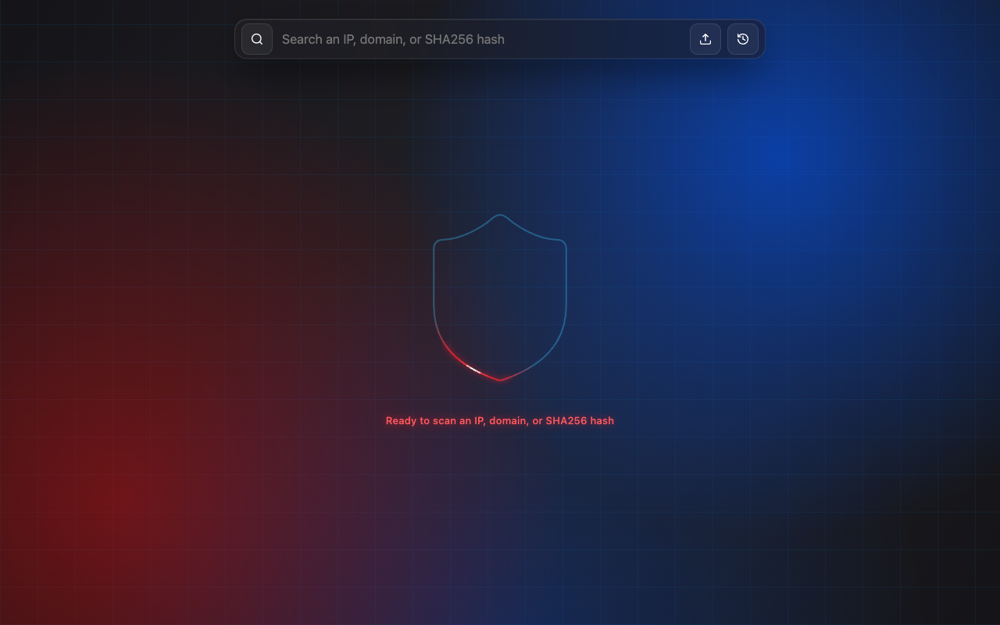
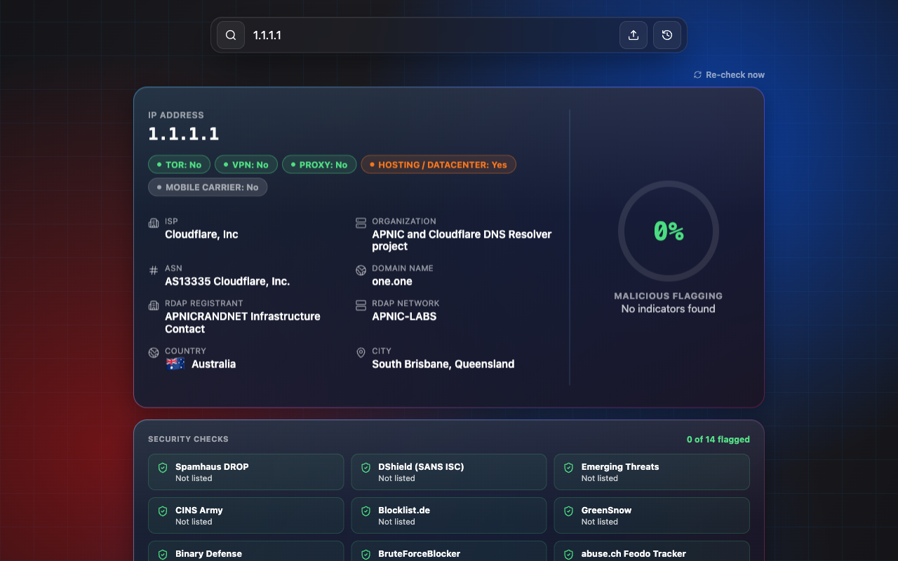
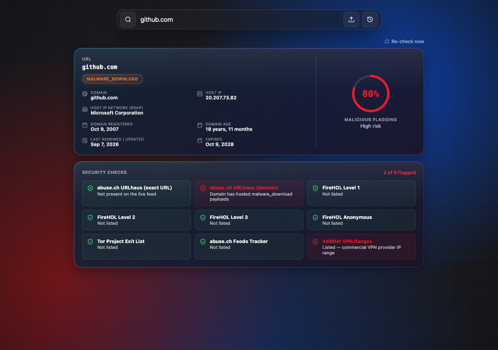

# Intel — Keyless Threat Intelligence Lookup

A threat-intelligence lookup tool for IPs, domains/URLs, and file hashes — built entirely on
**free, keyless, real data sources**. No API keys, no paid feeds, no fabricated results.

## Screenshots

**Home**



**IP lookup** — geolocation, ASN/ISP, RDAP, reverse DNS, and a live security-checks panel



**URL/domain lookup** — WHOIS/RDAP registration dates, host reputation, and per-source flagging



## Features

- **IP lookup** — geolocation (country, city, ISP, ASN), RDAP network/registrant, reverse DNS,
  and Tor/VPN/proxy/hosting/mobile-carrier detection as distinct signals (not one combined flag)
- **URL/domain lookup** — registrable-domain resolution, RDAP registration dates with a WHOIS
  crawl fallback for registries without RDAP, host IP reputation, and malicious-URL matching
- **File lookup** — SHA256/SHA1/MD5 hashing, PE structure and digital-signature checks, import
  and entropy analysis, all from files uploaded directly (never sent to a third party)
- **Security Checks panel** — every result shows a full breakdown of each source checked, clean
  or flagged, not just a single aggregate score
- **Animated circular risk score**, lookup history, and a 24h result cache with a manual
  "Re-check now" bypass

### Data sources (all free, no API key required)

Every vendor is checked separately and listed in the Security Checks panel, clean or flagged.

**IP reputation (14 vendors)**

- [Spamhaus DROP](https://www.spamhaus.org/drop/) — hijacked / criminal netblocks
- [DShield (SANS ISC)](https://isc.sans.edu/) — top attacking subnets
- [Emerging Threats](https://rules.emergingthreats.net/) — compromised hosts
- [CINS Army](https://cinsscore.com/), [Blocklist.de](https://www.blocklist.de/), [GreenSnow](https://greensnow.co/),
  [Binary Defense](https://www.binarydefense.com/), [BruteForceBlocker](https://danger.rulez.sk/) — attackers, scanners, brute force
- [abuse.ch](https://abuse.ch/) Feodo Tracker (botnet C2) and ThreatFox (malware infrastructure, with the malware name)
- [Botvrij.eu](https://www.botvrij.eu/) — OSINT indicators
- [Tor Project](https://check.torproject.org/torbulkexitlist) exit nodes, [FireHOL](https://iplists.firehol.org/) anonymous
  proxies and [X4BNet](https://github.com/X4BNet/lists_vpn) VPN ranges — for the Tor, Proxy and VPN badges

**URLs and domains (5 more vendors, plus the 14 above for the host IP)**

- [abuse.ch](https://abuse.ch/) URLhaus (malware URLs and domains) and ThreatFox (malware domains)
- [OpenPhish](https://openphish.com/) — live phishing URLs
- [CERT Polska](https://cert.pl/) — phishing and fraud domains

**Details**

- [ip-api.com](https://ip-api.com/) geolocation
- [RDAP](https://rdap.org/) for IP network and domain registration data
- Raw WHOIS (RFC 3912, port 43) as a fallback for registries without RDAP support

## Tech stack

- **Backend:** FastAPI, SQLAlchemy + SQLite, httpx, `tldextract`, per-client rate limiting
  (`slowapi`)
- **Frontend:** React, TypeScript, Vite

## Running locally

### Backend

```bash
cd backend
python3 -m venv .venv && source .venv/bin/activate
pip install -r requirements.txt
uvicorn main:app --reload --port 8200
python -m unittest discover -s tests   # feed parser and vendor-check tests
```

### Frontend

```bash
cd frontend
npm install
npm run dev
```

The frontend expects the API at `http://localhost:8200` by default — override with
`VITE_API_BASE` for a different backend URL, and set `CORS_ALLOWED_ORIGINS` on the backend
(comma-separated) when deploying so it isn't wide open to any origin.

## Deploying the website (Cloudflare Pages)

The live site is **https://intelreport.in**; its API is **https://api.intelreport.in** (the
phone backend, through a Cloudflare tunnel). `frontend/.env.production` points production
builds at that API.

In Cloudflare: **Workers & Pages → Create → Pages → Connect to Git**, pick this repository, and use:

| Setting | Value |
|---|---|
| Production branch | `main` |
| Framework preset | None (or Vite) |
| Root directory | `frontend` |
| Build command | `npm run build` |
| Build output directory | `dist` |
| Environment variable | `NODE_VERSION` = `22` |

Then add `intelreport.in` under the project's **Custom domains**. Every push to `main`
redeploys the site.

## Running the backend on an Android phone (Termux)

The phone acts as the API server; the frontend can stay wherever it's hosted.

1. Install **Termux** and **Termux:Boot** from F-Droid (the Play Store build of Termux is
   outdated). Open Termux:Boot once so Android allows it to run at boot.
2. In Android settings, set Termux's battery usage to **Unrestricted**, otherwise Android kills
   the server in the background.
3. In Termux, get the code and run the one-time setup (compiling `pydantic-core` takes about
   10–20 minutes on a phone):

   ```bash
   pkg install -y git
   git clone https://github.com/kishorcoder/intelreport.git
   cd intelreport/backend
   bash mobile/setup-termux.sh
   ```

4. Edit `backend/mobile/.env` (created from `mobile/.env.example`), then start the API:

   ```bash
   ./mobile/start.sh
   ```

5. Reach it from other devices:
   - **Same Wi-Fi:** `http://<phone-ip>:8200` (find the IP with `ifconfig` in Termux).
   - **From the internet:** run `./mobile/tunnel.sh` in a second Termux session. Without a
     token it prints a temporary `https://*.trycloudflare.com` URL that changes on every
     restart. For a fixed URL such as `https://api.intelreport.in`, create a tunnel in the
     Cloudflare Zero Trust dashboard pointing to `http://localhost:8200` and put its token in
     `CLOUDFLARE_TUNNEL_TOKEN`.

6. Point the frontend at the phone: build it with `VITE_API_BASE=<phone or tunnel URL>`, and
   set `CORS_ALLOWED_ORIGINS` in `mobile/.env` to the frontend's origin.

### Keeping it running

`./mobile/keepalive.sh` runs the API and the tunnel in the background and restarts either one
whenever it exits (crash, network drop, Android killing it). It also restarts the API if it stops
answering health checks for three minutes, and holds a Termux wake lock so the screen can be off.
Stop everything with `./mobile/stop.sh`. `bash mobile/install-boot.sh` makes Termux:Boot start
`keepalive.sh` on every boot. Logs: `~/intel-backend.log`, `~/intel-tunnel.log` and
`~/intel-keepalive.log`.

Android still decides what runs in the background, so also set Termux's battery usage to
**Unrestricted**, allow it to **autostart** (Xiaomi, Oppo, Vivo, Realme, Samsung), keep mobile
data allowed in the background, and keep the phone charging.

The phone install uses `requirements-mobile.txt`: plain `uvicorn` instead of
`uvicorn[standard]`, plus Termux's prebuilt `cryptography`. If `cryptography` is missing, file
analysis still reports whether a file is signed, but not who signed it.

## Security notes

- Every lookup endpoint is rate-limited per client IP.
- The WHOIS crawler validates that any referral server it follows resolves to a public address
  before connecting, since that hostname comes from a remote server's own response text.
- File analysis runs entirely in memory — nothing is written to disk or executed.
